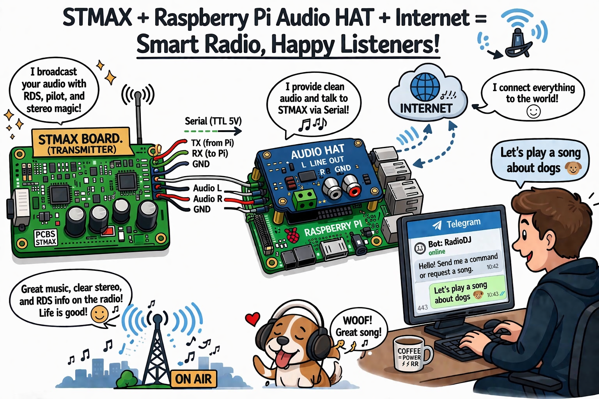
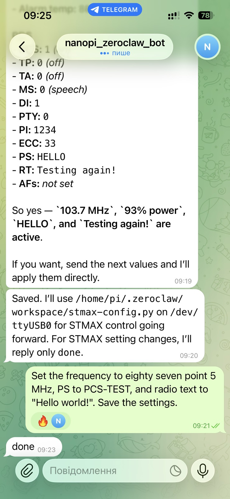
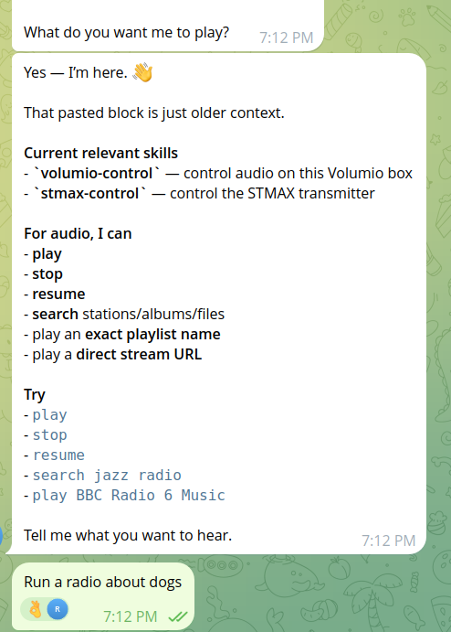
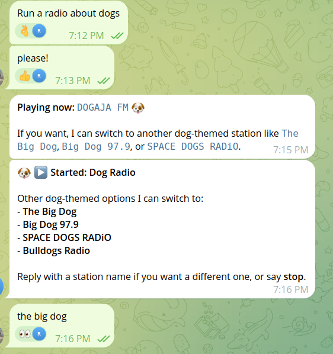
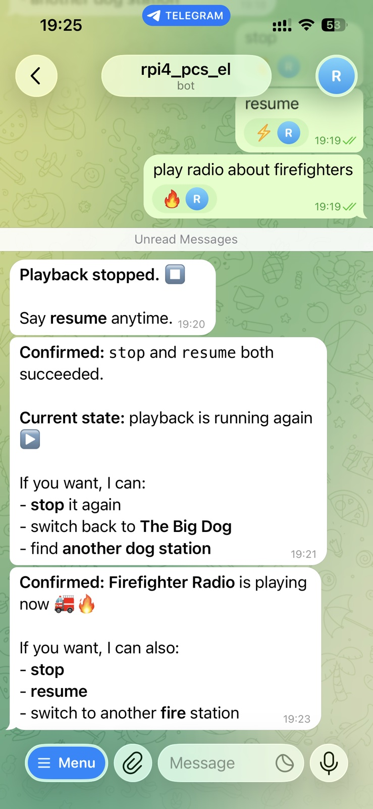
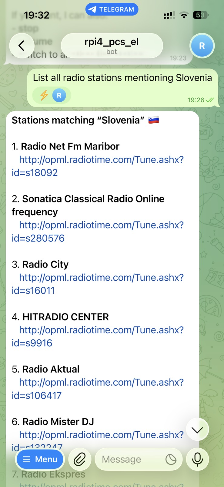
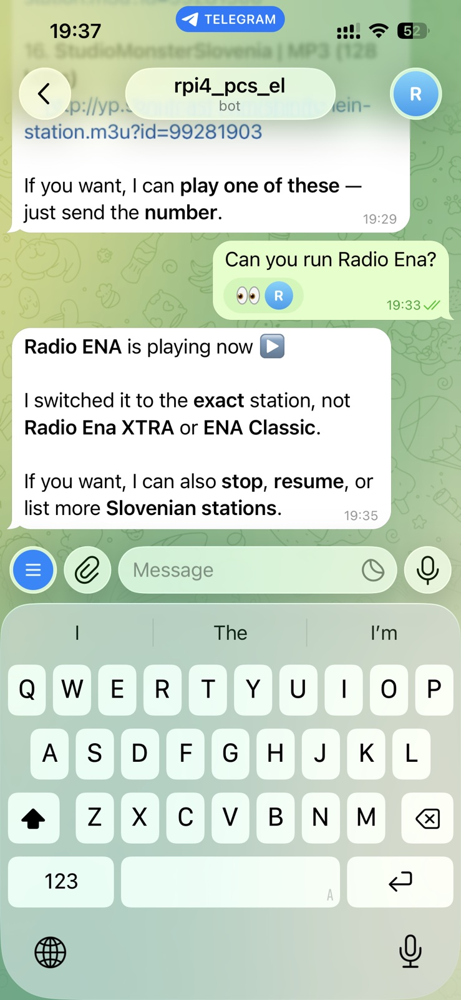

# CyberMax AI DJ

CyberMax AI DJ lets you control your broadcasting radio station and run songs or audio streams from anywhere via your preferred messenger.

Chat with your transmitter with free software and with zero subscription cost! Build you own AI-controlled radio station following the instructions below.



## Examples of use

```
* Set the transmitter frequency to eighty-seven point five mhz
* Set RDS text to "I love you!"
* Play an Internet audio stream about the firefighters
* Stop the playback
```

## What It Does

* Communicates to the user via Telegram or other messenger
* Sets frequency, power, RDS, and other parameters of the STMAX transmitter board
* Starts/stops playback and can search/run/queue local audio files and Internet audio streams in Volumio

## Hardware You Will Need

* An STMAX FM radio transmitter board with audio inputs and serial (TTL) interface: https://www.pcs-electronics.com/shop/rf-accesories-for-transmitters/radio-kits/stmax9015-9025-9050-9075-stereo-rds-exciter/
* An audio HAT board with audio DAC 5V DC-DC converter: https://www.pcs-electronics.com/shop/wireless-audio-video-links/ip-audio-video-links/internet-radio-receiver/
* A Raspberry PI computer, like RPI4

Other combinations of radio transmitters and computers will work fine as well.

## Workflow

1. Install Volumio from https://volumio.com/
   Enable SSH access to the computer (Google for instructions)
   Enable the hardware serial port of the RPI device (Google for instructions)
2. Install an AI agent, such as Zeroclaw https://zeroclaw.org/
   Try to figure out what an AI agent is and how it works
   Configure AI provider and model (such as a free `mistralai/devstral-2-123b-instruct-2512` model via build.nvidia.com)
   Configure channel, such as a Telegram bot
3. Visit the https://github.com/pcs-electronics/stmax-config and https://github.com/pcs-electronics/volumio-control pages
   Copy `stmax-config.py` and `volumio-control.py` scripts to the workspace folder of your AI agent program
   Copy the `/skills/stmax-control/` and `/skills/volumio-control/` folders into the appropriate `/skills/` folder of your AI agent
4. Interconnect your hardware and apply power
5. Run your AI agent and set your transmitter's frequency, power, and run Internet audio streams or local files

## Real Queries

Query: add first found web stream about river to the play queue  
Response:  
```
The first web radio stream found, "The River", has been added to the play queue and playback has started.  
Would you like to add any other items or perform another action?
```

Query: what is the current play list?  
Response:  
```
The current play queue contains the following items:
Magnifico - Pegica (Official Video) - 2.mp3
    Artist: Magnifico
    Album: Magnifico
    Duration: 325 seconds

The River
    Web Radio Stream
Would you like to modify the queue or perform another action?
```

## Screenshots








